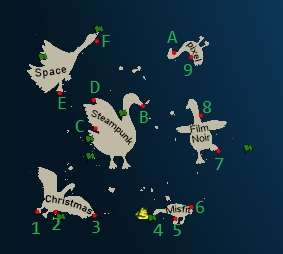

# C3 - SANS Holiday Hack Challenge

## Description

The good folks over at [SANS Institute](https://www.sans.org/) put together an awesome challenge each year that allows us to _safely_ learn about cyber security from a variety of different pespectives. At this months C3 Meetup we are going to divide up into small groups and try to solve some of the challenges, learn some new things about security, and hopefully
talk about how we can integrate wat we have learned into our day jobs to create more secure software.

## The Objective

- Have fun playing games with friends
- Be Creative
- Challenge Yourself
- Learning About Security
- Think about how systems can be misused / abused
- Think about how the systems you build can be misused / abused

## The Process

As developers we are familiar with circular processes like Test Driven Development and Agile Cadences. Hacking can have a similar workflow / cycle

"The problem spiral" Adapted from [Katie Knowles, How to Holiday Hack It: Tips for Crushing CTFs & Pwning Pentest](https://www.youtube.com/watch?v=c02mH7F1xvU)

1. Reconnaissance
2. Identify Potential Vulnerability
3. Identify Exploit
4. Test Exploit - Go back to step 2
5. Integrate New Information - Go back to step 1

Another way of looking at it

1. Situational Awareness
   - Understand the Problem
   - Playing around with the software
   - Use the system as it's intended to be used
   - Read the code
   - Watch the network traffic
   - Reconnaissance - What software is being used, where is it hosted, how's it communicating, etc.
2. Devise a Plan
   - Use what you have learned from situational awareness
   - Use previous experience
   - Google about the technology being used
3. Carry out the Plan
   - Take notes
   - Capture new information
   - Learn something new? Go back to situation awareness / devise a plan and incorporate your learnings

Get stuck? Go back through your notes and brainstorm

## The Disclaimer

- Be smart, use this information conscientiously to understand and improve security, and to put the ethical into Ethical Hacker!
- The information learned today _MUST ONLY_ be used on property _YOU OWN_.
- Using these techniques on your _friend's_ computer, your _neighbor's_ door lock, your _client's_ website, and most other situations is generally _illegal_ without _explicit written consent_.

## The Map

| Index | Island                | Port                    |
| ----- | --------------------- | ----------------------- |
| 1     | Christmas Island      | Orientation             |
| 2     | Christmas Island      | Frosty's Beach          |
| 3     | Christmas Island      | Rudolph's Rest          |
| 4     | Island of Misfit Toys | Scaredy Kite Heights    |
| 5     | Island of Misfit Toys | Tarnished Trove         |
| 6     | Island of Misfit Toys | Squarewheel Yard        |
| 7     | Film Noir             | Chiaroscuro City        |
| 8     | Film Noir             | The Blacklight District |
| 9     | Pixel Island          | Rainraster Cliffs       |
| A     | Pixel Island          | Driftbit Grotto         |
| B     | Steampunk Island      | Brass Bouy Port         |
| C     | Steampunk Island      | Rusty Quay              |
| D     | Steampunk Island      | Coggoggle Marina        |
| E     | Space Island          | Spaceport Point         |
| F     | Space Island          | Cape Cosmic             |

## The Excercise(s)

### Challenge 1 - Combination Lock

Location: Steampunk Island - Brass Bouy Port
Talk To: Bow Ninecandle
Skill: Understand how to defeat Master lock combination locks

Hints / Links

- [General Lock Info - How To Open A Dial Combination Lock](https://www.youtube.com/watch?v=3zwZgQcaE38)
- [How To Decode A Dial Combination Lock In 8 Attempts Or Less](https://www.youtube.com/watch?v=27rE5ZvWLU0)
- [How To Decode Dial Combo Locks - Doc](https://docs.google.com/document/d/1QhKZLDr22G0RpuTSGm0M6pz4dG82IByesim3elwfw98/edit)

Addition Challenges:

- Write code to generate possible lock combinations
- Try your hand at lock sports with physical Master Combination locks or padlocks
- Try the Luggage Lock Decode challenge
  - Location: Island of Misfit Toys – Squarewheel Yard
  - Talk To: Garland Candlesticks

### Challenge 2 - Snowball Fight

Location: Christmas Island - Frosty's Beach, left past the sponsor booths
Talk to: Morcel Nougat
Skill: JavaScript, reading code, browser reconnaissance
Addition Challenges:

- Beat the game in single player mode
- [Challenge 4](#challenge-4---naan)
- Elf Hunt – Piney Sappington – Pixel Island - Rainraster Cliffs

### Challenge 3 - Learn Something New

#### Azure 101

Location: Christmas Island – Rudolph’s Rest, left bottom corner of island
Talk to: Sparkle Redberry
Skill: Azure CLI, Cloud reconnaissance

#### Linux 101

Location: Christmas Island – Frosty’s Beach, left past sponsor booths
Talk to: Ginger Breddle
Skill: Linux command line, Linux tools

### Challenge 4 - Na'an

Location: Film Noir Island
Talk to: Shifty McShuffles
Skill: JavaScript, code reading, blind attacks, server side attacks, technology enumeration

### Challenge 5 - Hashcat

Location: Island of Misfit Toys - Scaredy Kite Heights
Talk to: Eve Snowshoes
Skill: Recover / Crack a password

# C3ProjectTemplate

See solutions in different languages in the "Templates" directory. Once you decide which language you'd like to use,
simply open that directory in your favorite IDE, and you should be able to run the included unit tests "out of the box".

The recommended IDEs are as follows, but feel free to use whatever IDE you are comfortable with.

- [C#](Templates/C%23) - [Microsoft Visual Studio](https://visualstudio.microsoft.com/vs/community/)
- [Java](Templates/Java) - [IntelliJ Idea](https://www.jetbrains.com/idea/download) (Community Edition is fine)
- [JavaScript](Templates/JavaScript) - [Microsoft Visual Studio Code](https://code.visualstudio.com/)
- [Kotlin](Templates/Kotlin) - [IntelliJ Idea](https://www.jetbrains.com/idea/download) (Community Edition is fine)
- [Python](Templates/Python) - [Pycharm](https://www.jetbrains.com/pycharm/download/?section=windows) (Community Edition is fine)
- [TypeScript](Templates/TypeScript) - [Microsoft Visual Studio Code](https://code.visualstudio.com/)
